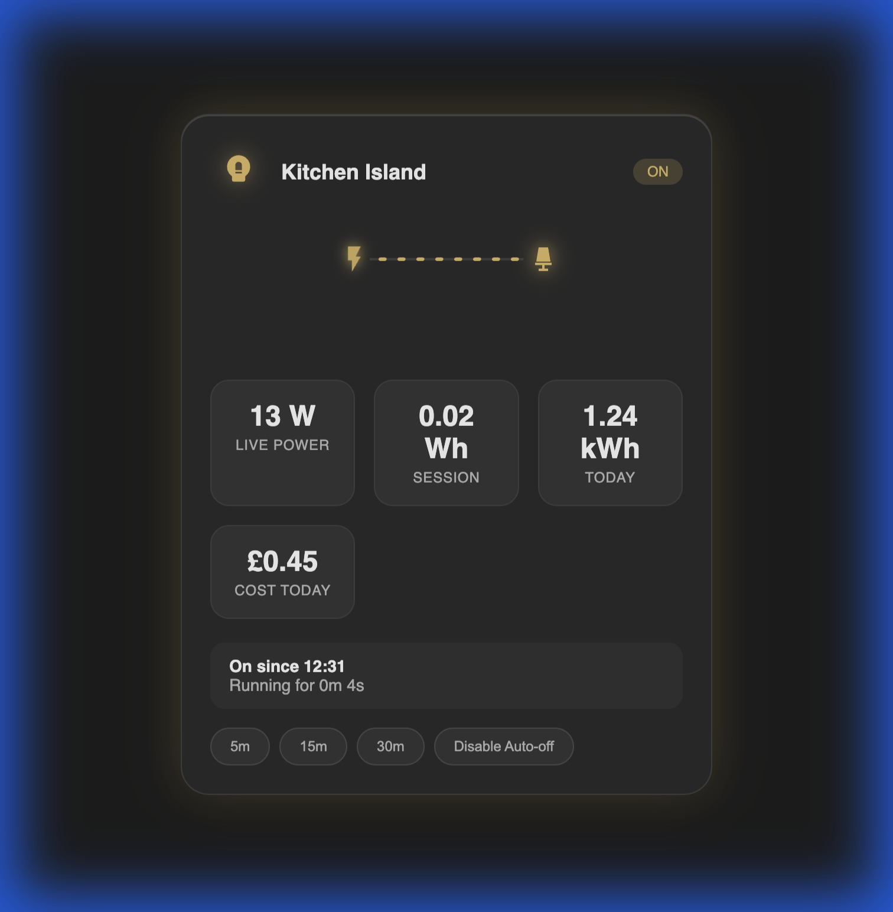

# Project Report: Lux Switch Energy Card

## Executive Summary
The **Lux Switch Energy Card** is a premium, glassmorphic custom card for Home Assistant designed to provide deep energy monitoring insights with a high-end aesthetic. It evolved from a monolithic prototype into a modular, production-ready frontend component, now hardened with professional governance and refined visual hierarchy.

---

## 🛠 How it was Made

### Phase 1: UX & Interaction
- **Haptic Feedback**: Integrated tactile responses for toggles and timers.
- **Theming**: Implemented logic to support native HA Light/Dark modes perfectly.
- **Standard Actions**: Added support for `tap_action`, `hold_action`, and `double_tap_action`.

### Phase 2: Architecture & Performance
- **Vite Migration**: Integrated **Vite** for optimized bundling, shrinking the payload to ~58kB.
- **Modularization**: Decoupled core logic into clean, reusable files: `sparkline.ts`, `power-flow.ts`, `localize.ts`, and `styles.ts`.

### Phase 3: Advanced Data Layer
- **History Backfill**: Integration with the Home Assistant **History API** ensures charts populate immediately on card load.
- **Budgeting System**: Reactive progress bars track energy/cost against daily limits.

### Phase 4: Custom Animation
- Designed a custom **SVG Power Flow** component with dynamic speeds tied to real-time power (Watts).

### Phase 5: Productisation & Governance (v1.1.1)
- **Configuration Hardening**: Implemented a normalization layer that validates all user inputs, clamps values to safe ranges (e.g., blur 0-30, opacity 0.02-0.20), and resolves conflicts.
- **Visual Hierarchy**: Refined the "OFF" state to be 15% quieter (desaturated and shadowless) and improved modal overlays to feel like secondary "sheets."
- **HACS Compliance**: Added `hacs.json` for seamless installation via the Home Assistant Community Store.
- **Feature Contract**: Established a clear "v1 Contract" and "Design Intent" to prevent scope creep and maintain UX quality.

---

## ✨ Feature Analysis

| Feature | Description | Technical Implementation |
| :--- | :--- | :--- |
| **Glassmorphism** | Frosted glass look with customizable blur/opacity. | CSS Backdrop-filter & Variables |
| **History Fetch** | Charts are pre-filled on page refresh. | HA WS API (`history/period`) |
| **Live Flow** | Visual pulse and flow particles. | CSS Keyframes & SVG `stroke-dashoffset` |
| **Governance** | Auto-validation and clamping of config values. | `config-utils.ts` Normalization Layer |
| **Calm UX** | Quiet OFF states and smooth modal transitions. | Refined CSS Transitions & Opacity |
| **Reduced Motion** | OS-level respect for motion sensitivity. | `prefers-reduced-motion` Media Queries |

---

## 🔍 In-depth Technical Analysis

### 1. Performance & Accessibility
- **GPU Optimization**: All animations are offloaded to the GPU using CSS `transform` and `opacity`.
- **Motion Control**: The card automatically pauses all "breathe" and "flow" animations if the user has motion sensitivity enabled at the OS level.

### 2. Configuration Governance
- **Strict Validation**: The card now throws clear errors for missing required entities and emits single, throttled console warnings (`warnOnce`) for optional field misconfigurations.
- **Safe Ranges**: Visual parameters (blur, radius, etc.) are strictly enforced to maintain the "Luxury" design integrity even with experimental user configs.

### 3. Sustainability
- **HACS Ready**: Full compliance with HACS standards including repository structure and naming conventions.
- **Documentation**: Extensive `README.md` and `CHANGELOG.md` ensure long-term maintainability by the community.

---

## 🚀 Final Conclusion
The card is now at **v1.1.1** and represents a fully productised luxury frontend. It bridges the gap between functional power monitoring and high-end "Calm-Tech" design, offering both visual wow-factor and industrial-grade stability.
